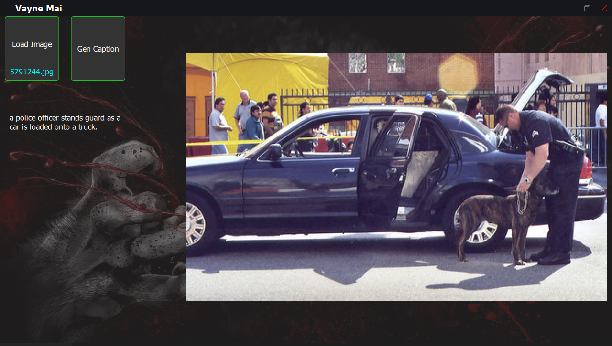

# Image-Captioning
Integrate Simple Image Captioning on PyQt5

 

   

## Introduction 
This repository with simple image captioning with CLIP (ViT-B/32) pre train model

## How to run

1. Clone this repository.
` git clone  https://github.com/TieuDiem/Image-Captioning.git `
2. Install lib.
`pip install -r requirements.txt`
3. Scripts test
run file main.py
4. GUI test
run file main.py in GUI folder 

